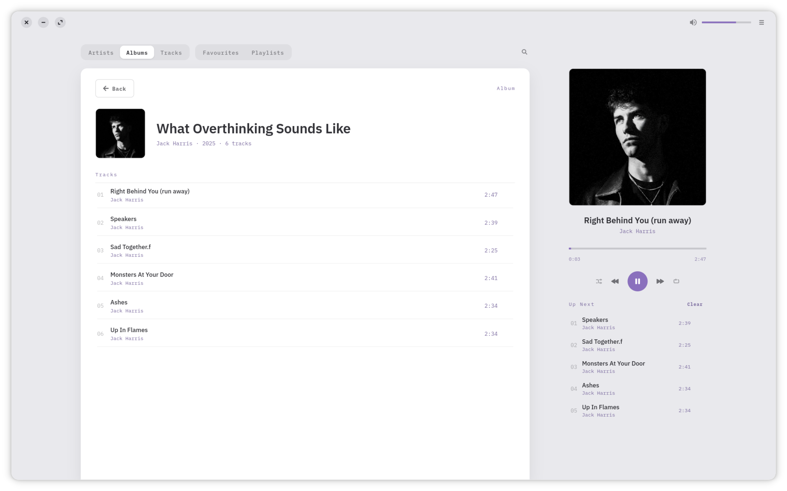
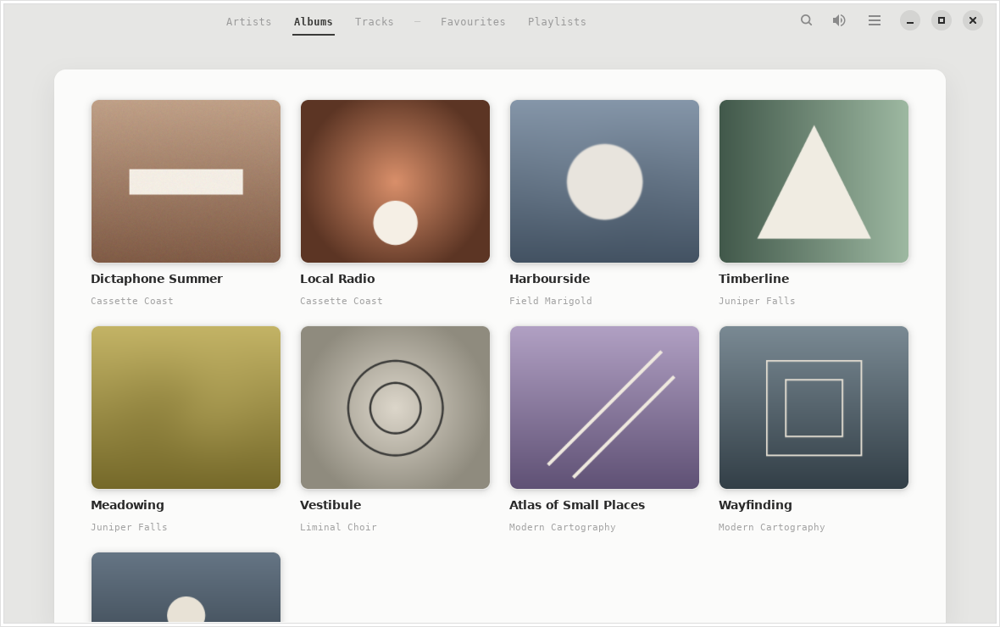
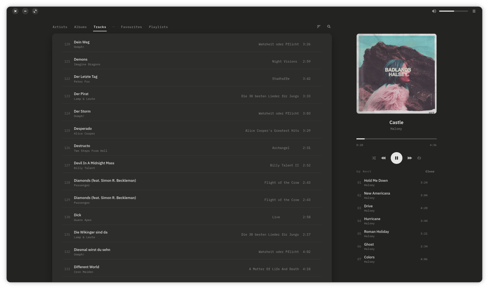

<p align="center">
  
</p>

<h1 align="center">Lyre</h1>

<p align="center">
  A calm, focused player for the music you already own —<br>
  no accounts, no cloud, no noise. Just your library, beautifully laid out.
</p>

<p align="center">
  
</p>

<p align="center">
  
  
</p>

## What it does

Lyre scans your music folders into a local library — artists, albums,
tracks, favourites and playlists — and gets the details right:

- **Gapless playback** with shuffle, repeat and an editable Up&nbsp;Next queue
- **Cover art from your files' own tags**, with MusicBrainz as a fallback
  and hand-picked images always winning
- **Tag editing** for tracks, albums and artist names — written back into
  the files themselves, so your fixes are permanent and portable
- **Desktop integration**: media keys, sound menu and lock-screen controls
  (MPRIS), track-change notifications, and your laptop stays awake while
  music plays
- **It remembers**: window size, volume, queue, shuffle/repeat, last tab —
  quit and pick up where you left off
- Folder watching, a sleep timer, full keyboard control, and light and dark
  themes that follow your system

## Install

Grab the latest `.flatpak` bundle from the
[**Releases**](https://github.com/DrVonMiau/lyre/releases) page, then
install and run it:

```sh
flatpak install --user io.github.drvonmiau.Lyre.flatpak
flatpak run io.github.drvonmiau.Lyre
```

The first command may offer to pull in the GNOME runtime the app needs —
say yes. You only need [Flatpak](https://flatpak.org/setup/) installed,
which most Linux distributions already have.

## Building from source

Open the project in **GNOME Builder** and press Run — the included Flatpak
manifest (`io.github.drvonmiau.Lyre.json`) takes care of everything,
including the IBM Plex fonts the design uses.

Or with flatpak-builder directly:

```sh
flatpak-builder --user --install --force-clean _flatpak io.github.drvonmiau.Lyre.json
flatpak run io.github.drvonmiau.Lyre
```

## License

Lyre is free software, released under the
[GNU GPL 3.0 or later](COPYING).
